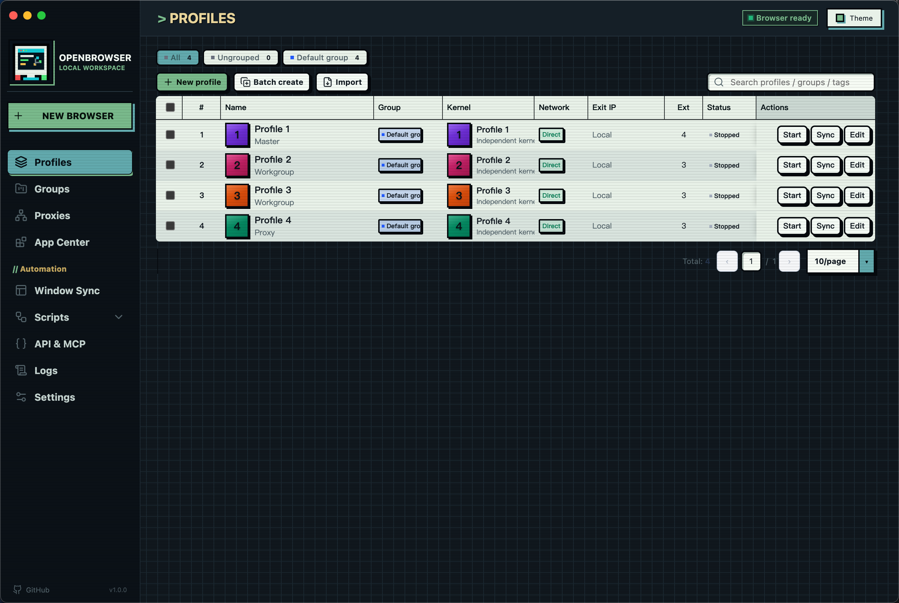
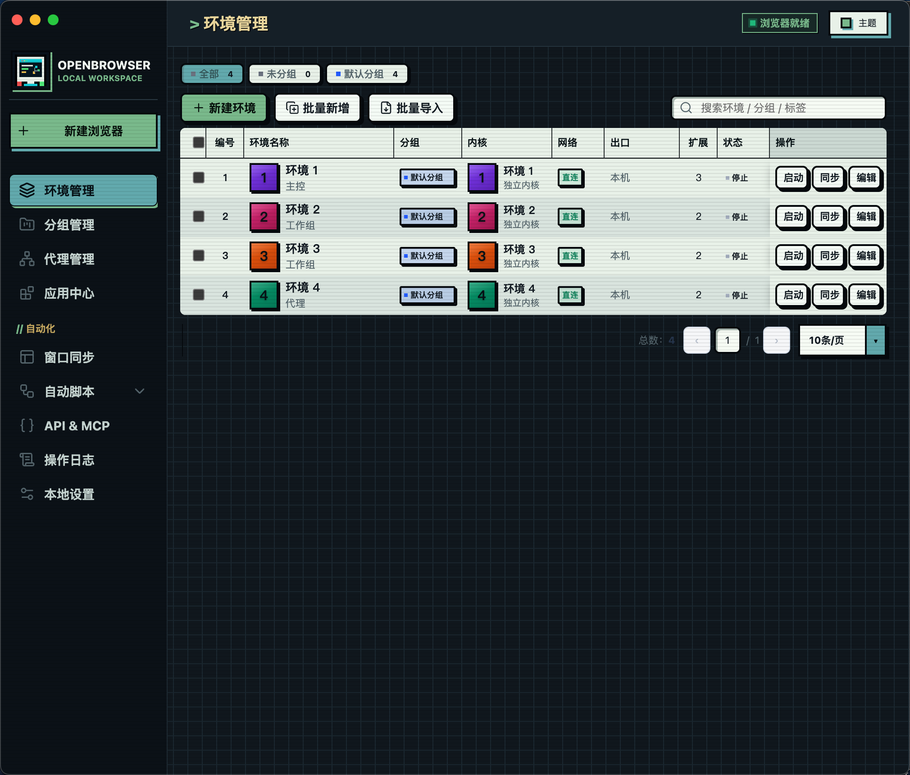
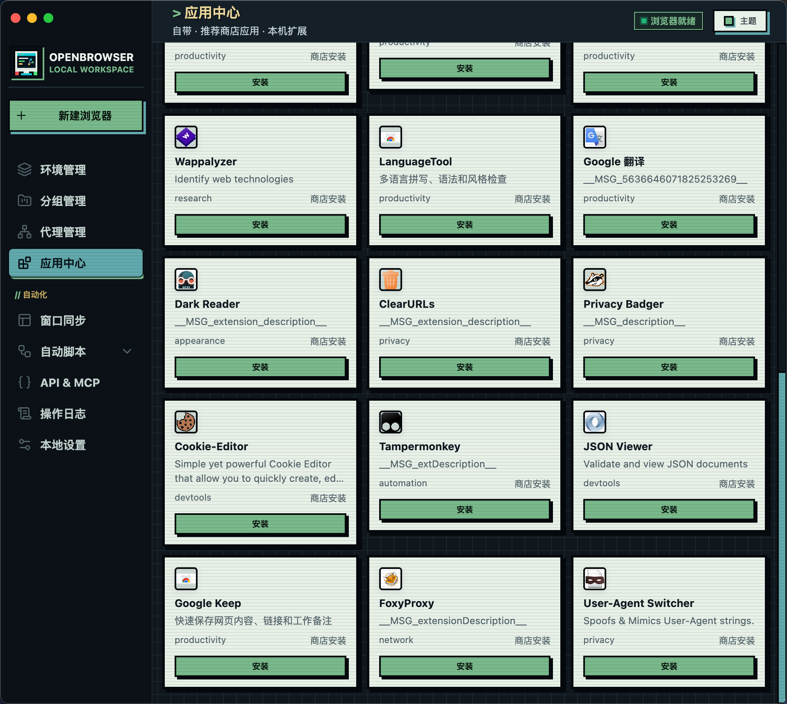
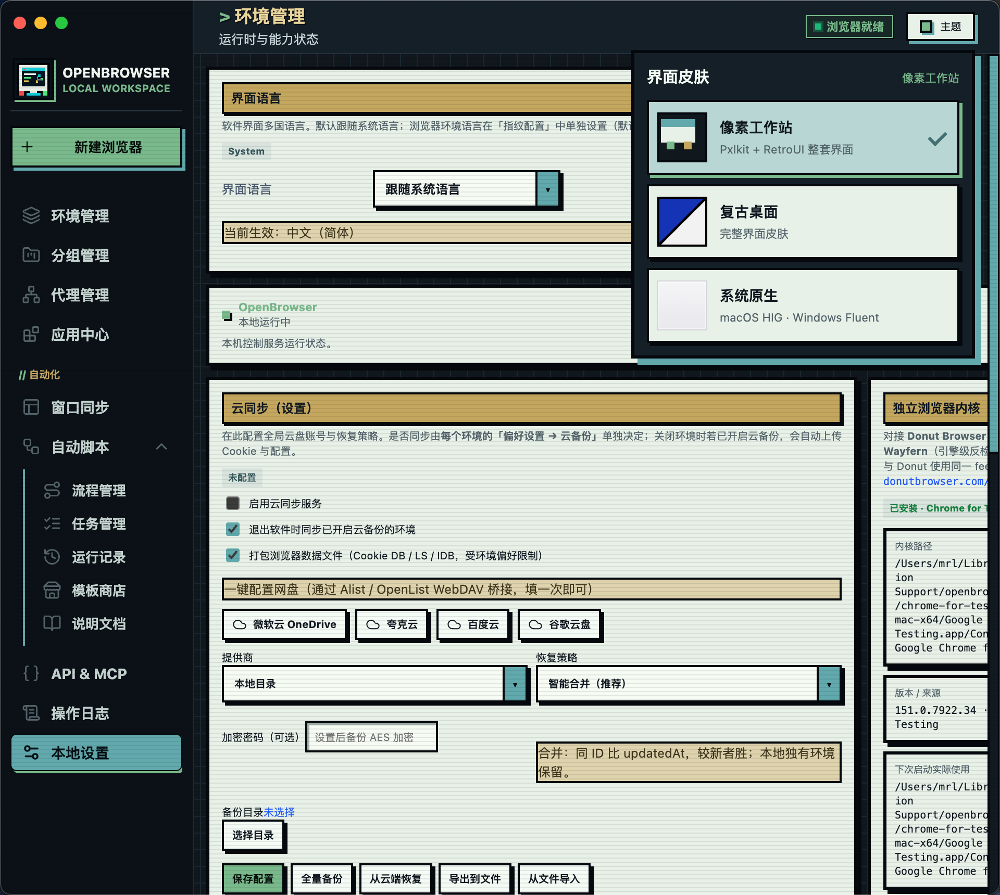

# OpenBrowser


---

## 中文

OpenBrowser 是一款本地指纹浏览器。用来管多套互相隔离的 Chromium 环境，代理、指纹、扩展、窗口同步、本机 API、MCP 和本地 RPA 都集中在一个桌面应用里做。

界面语言可在本地设置里切换，目前支持中文和英文。

### 界面预览

| 主界面 | 环境管理 |
| --- | --- |
|  |  |
| 主导航和各模块入口 | Profile 列表、启动/停止、分组和状态 |

| 环境与指纹编辑 | 本地设置与主题 |
| --- | --- |
|  |  |
| 代理、指纹参数、扩展等按环境配置 | 主题、语言和系统相关设置 |

### 主要功能

- **环境隔离**：每个环境独立 Profile，Cookie、缓存、LocalStorage、IndexedDB、扩展状态互不混用
- **批量管理**：列表、分组、标签、批量启停、状态刷新、日志、窗口尺寸
- **代理**：HTTP / HTTPS / SOCKS，统一维护，可按环境绑定并做出口检测
- **指纹参数**：平台、语言、时区、UA、Client Hints、Canvas、WebGL、WebRTC、硬件并发、内存等
- **扩展与应用中心**：内置、推荐和本地扩展，按环境加载
- **窗口同步**：通过 CDP 同步点击、滚动、输入、标签页和窗口操作
- **本地 RPA**：流程、任务、模板和运行记录；支持打开页面、等待、点击、输入、截图等
- **Local API / MCP**：本机 HTTP API（默认只监听回环地址）+ stdio MCP，方便接外部工具
- **独立内核**：可下载独立 Chromium，也可指定本地自定义路径（本仓库不打包内核二进制）
- **备份**：本地、WebDAV、GitHub、谷歌云、微软云、夸克、百度等；只有你主动配置或操作时才会访问外部服务

### 适合做什么

- 本机维护多套 Profile，分别配代理、扩展、语言、时区、启动页
- 多账号 / 多环境批量启动、检查状态、做窗口同步
- 用 API、MCP 或 RPA 把重复操作串起来
- 测扩展、页面兼容性、代理出口、独立内核

不保证匿名、指纹唯一、账号成功率、自动化稳定，也不保证对某个网站一定兼容。用之前请看 [`DISCLAIMER.md`](./DISCLAIMER.md)。

### 支持平台

| 平台 | 架构 | 状态 |
| --- | --- | --- |
| Windows | x86_64 | 支持 |
| macOS | x86_64 | 支持 |
| macOS | arm64 | 支持 |

### 项目结构

```text
OpenBrowser/
├── Browserapp/            # 应用源码
├── docs/screenshots/      # README 截图
├── start-test.command     # macOS 测试启动
├── start-test.cmd         # Windows 测试启动
├── DISCLAIMER.md
├── LICENSE
└── README.md
```

仓库里只有源码、文档和构建脚本，不包含用户 Profile、Cookie、代理账号、浏览器内核、运行日志或安装包。

### 快速开始

需要 Node.js LTS 和 npm：

```bash
cd Browserapp
npm ci --include=dev
npm run selftest
npm start
```

也可以从仓库根目录用启动脚本（会进入 `Browserapp/`，缺桌面运行时会装依赖）：

- macOS：[`start-test.command`](./start-test.command)
- Windows：[`start-test.cmd`](./start-test.cmd)

### 能力说明

**环境**  
在列表里建 Profile。名称、编号、分组、标签、窗口尺寸、启动页、代理、扩展、指纹、数据保留策略都可以按环境单独设。启动后会等独立 CDP 端口就绪；关掉最后一个浏览器窗口后状态会自动同步回来。

**代理与指纹**  
代理库负责增删改查、批量检测和分配。环境编辑器里改平台、语言、时区、UA 等参数。代理认证走本地转发；指纹通过 CDP 在启动和新开标签时注入。

**窗口同步与 RPA**  
主控窗口的操作可以同步到其他环境。RPA 按流程执行 `goto`、`wait`、`click`、`type`、截图和变量处理等，数据都存在本机。

**Local API 与 MCP**  
主进程会起本地自动化服务，默认 `127.0.0.1:50325`。HTTP 可查版本、列环境、启停、触发同步、跑 RPA。MCP 入口：`automation/mcp-server.js`（stdio）。

**内核、扩展、同步**  
内核由 `automation/browser-kernel.js` 管理，Profile 数据限制在专属目录。应用中心管扩展；云同步支持加密备份包和合并恢复。

### 自测

在 `Browserapp/` 下：

```bash
npm run selftest
npm run selftest:automation
npm run selftest:protocol
npm run selftest:isolation
npm run selftest:kernel
npm run selftest:cloud
```

| 命令 | 说明 |
| --- | --- |
| `npm run selftest` | 基础环境与配置 |
| `npm run selftest:automation` | 自动化、RPA、本地服务 |
| `npm run selftest:protocol` | 协议与同步 |
| `npm run selftest:isolation` | Profile 与隔离 |
| `npm run selftest:kernel` | 内核策略 |
| `npm run selftest:cloud` | 云同步安全策略 |

### 打包

```bash
cd Browserapp
# 可选：OPENBROWSER_PACKAGE_ARCH=x86_64 或 arm64
npm run package:portable
```

产物在 `Browserapp/dist/`。Windows 包里有 `START.cmd`，macOS 包里有 `OpenBrowser.app` 和 `启动.command`。

### 数据与安全

请不要提交或公开：

- `.env`、API Key、令牌
- Cookie、密码、代理账号密码
- Profile、缓存、日志、运行输出
- Chromium 运行时、第三方二进制、生成的安装包

本地 API 默认只绑回环地址。若设置了 `OPENBROWSER_API_KEY`，请求需带 `api-key` 头。云同步、应用商店图标、第三方备份只有你主动用时才会出网。第三方说明见 [`THIRD-PARTY-NOTICES.md`](./Browserapp/THIRD-PARTY-NOTICES.md)。

### 更多文档

- 自动化模块：[`Browserapp/automation/README.md`](./Browserapp/automation/README.md)
- 免责声明：[`DISCLAIMER.md`](./DISCLAIMER.md)

### 第三方内核

独立内核不是我们自研的。默认走 [Donut Browser](https://github.com/zhom/donutbrowser)（作者 [zhom](https://github.com/zhom)）公开的更新源 [wayfern.json](https://donutbrowser.com/wayfern.json)，下载的是 [Wayfern](https://wayfern.com/) 的反检测 Chromium（二进制来自 `download.wayfern.com`，使用请遵守 [Wayfern 服务条款](https://wayfern.com/tos)）。当前平台没有 Wayfern 包时，会回退到 Google 的 [Chrome for Testing](https://github.com/GoogleChromeLabs/chrome-for-testing)（更新源：[last-known-good-versions-with-downloads.json](https://googlechromelabs.github.io/chrome-for-testing/last-known-good-versions-with-downloads.json)）。OpenBrowser 只按公开源拉取，不重新分发这些内核。

### 许可证

MIT，见 [`LICENSE`](./LICENSE)。

---

## English

OpenBrowser is a local fingerprint browser for managing multiple isolated Chromium environments. Proxies, fingerprints, extensions, window sync, a local API, MCP, and basic RPA live in one desktop app.

The UI language can be switched in local settings. Chinese and English are available today.

### Screenshots

| Overview | Environments |
| --- | --- |
|  |  |
| Main nav and module entry points | Profiles, start/stop, groups, status |

| Profile / fingerprint editor | Local settings & themes |
| --- | --- |
|  |  |
| Proxy, fingerprint, extensions per environment | Theme, language, system options |

### Features

- **Isolation** — separate profile directory per environment (cookies, cache, LocalStorage, IndexedDB, extensions)
- **Batch management** — list, groups, tags, bulk start/stop, status refresh, logs, window size
- **Proxies** — HTTP / HTTPS / SOCKS, assign per environment, egress checks
- **Fingerprint knobs** — platform, language, timezone, UA, Client Hints, Canvas, WebGL, WebRTC, cores, memory, etc.
- **Extensions / App Center** — built-in, recommended, and local extensions, loaded per environment
- **Window sync** — CDP-based sync for click, scroll, input, tabs, and window actions
- **Local RPA** — flows, tasks, templates, run history (navigate, wait, click, type, screenshot, …)
- **Local API / MCP** — loopback HTTP API by default, plus stdio MCP for external tools
- **Independent kernel** — optional download of a standalone Chromium, or a custom local path (this repo does not ship kernel binaries)
- **Backup** — local, WebDAV, GitHub, Google, Microsoft, Quark, Baidu, etc. External services are only used when you configure or trigger them

### Typical use

- Keep several profiles on one machine with different proxy / extension / locale / start-page setups
- Batch-start test accounts, check status, sync windows
- Drive repetitive work through the local API, MCP, or RPA
- Check extensions, page behavior, proxy egress, and kernel choice

No promise of anonymity, unique fingerprints, account success rates, automation stability, or site-specific compatibility. Read [`DISCLAIMER.md`](./DISCLAIMER.md) before use.

### Platforms

| Platform | Arch | Status |
| --- | --- | --- |
| Windows | x86_64 | Supported |
| macOS | x86_64 | Supported |
| macOS | arm64 | Supported |

### Layout

```text
OpenBrowser/
├── Browserapp/            # app source
├── docs/screenshots/      # README screenshots
├── start-test.command     # macOS test launcher
├── start-test.cmd         # Windows test launcher
├── DISCLAIMER.md
├── LICENSE
└── README.md
```

Source, docs, and build scripts only. No user profiles, cookies, proxy credentials, kernels, runtime logs, or release packages.

### Quick start

Needs Node.js LTS and npm:

```bash
cd Browserapp
npm ci --include=dev
npm run selftest
npm start
```

Or use the root launchers (they `cd` into `Browserapp/` and install desktop runtime deps if missing):

- macOS: [`start-test.command`](./start-test.command)
- Windows: [`start-test.cmd`](./start-test.cmd)

### How it works (short)

**Environments**  
Create profiles in the list. Name, number, group, tags, window size, start page, proxy, extensions, fingerprint, and retention are per-environment. On launch, OpenBrowser waits for a dedicated CDP port; when the last browser window closes, status is synced back.

**Proxy & fingerprint**  
Proxy library: CRUD, batch checks, assignment. Editor: platform, language, timezone, UA, and related knobs. Auth goes through a local forwarder; fingerprint settings are injected over CDP at startup and on new tabs.

**Window sync & RPA**  
Mirror controller actions to other environments. RPA runs steps like `goto`, `wait`, `click`, `type`, screenshots, and variables. Everything stays on disk locally.

**Local API & MCP**  
Automation service defaults to `127.0.0.1:50325`. HTTP: version, list/start/stop environments, window sync, RPA. MCP: `automation/mcp-server.js` over stdio.

**Kernel, extensions, backup**  
Kernel logic lives in `automation/browser-kernel.js`; profile data is kept under dedicated directories. App Center handles extensions. Cloud sync supports encrypted backup packages and merge restore.

### Self-tests

From `Browserapp/`:

```bash
npm run selftest
npm run selftest:automation
npm run selftest:protocol
npm run selftest:isolation
npm run selftest:kernel
npm run selftest:cloud
```

| Command | What it covers |
| --- | --- |
| `npm run selftest` | Basic env / config |
| `npm run selftest:automation` | Automation, RPA, local service |
| `npm run selftest:protocol` | Protocol / sync |
| `npm run selftest:isolation` | Profile isolation |
| `npm run selftest:kernel` | Kernel policy |
| `npm run selftest:cloud` | Cloud-sync safety |

### Packaging

```bash
cd Browserapp
# optional: OPENBROWSER_PACKAGE_ARCH=x86_64 or arm64
npm run package:portable
```

Output goes to `Browserapp/dist/`. Windows packages include `START.cmd`; macOS packages include `OpenBrowser.app` and `启动.command`.

### Data & security

Do not commit or publish:

- `.env`, API keys, tokens
- Cookies, passwords, proxy credentials
- Profiles, cache, logs, runtime output
- Chromium runtimes, third-party binaries, generated installers

Local API binds to loopback by default. If `OPENBROWSER_API_KEY` is set, send an `api-key` header. Cloud sync, store icons, and third-party backup targets only go online when you use them. Third-party notices: [`THIRD-PARTY-NOTICES.md`](./Browserapp/THIRD-PARTY-NOTICES.md).

### More docs

- Automation: [`Browserapp/automation/README.md`](./Browserapp/automation/README.md)
- Disclaimer: [`DISCLAIMER.md`](./DISCLAIMER.md)

### Third-party kernels

The independent kernel is not built by us. By default we use the public feed from [Donut Browser](https://github.com/zhom/donutbrowser) (by [zhom](https://github.com/zhom)): [wayfern.json](https://donutbrowser.com/wayfern.json), which points at [Wayfern](https://wayfern.com/) anti-detect Chromium (`download.wayfern.com`; see [Wayfern ToS](https://wayfern.com/tos)). If Wayfern has no build for the current OS/arch, we fall back to Google’s [Chrome for Testing](https://github.com/GoogleChromeLabs/chrome-for-testing) ([last-known-good-versions-with-downloads.json](https://googlechromelabs.github.io/chrome-for-testing/last-known-good-versions-with-downloads.json)). OpenBrowser only fetches from these public sources and does not redistribute the kernels.

### License

MIT — see [`LICENSE`](./LICENSE).
